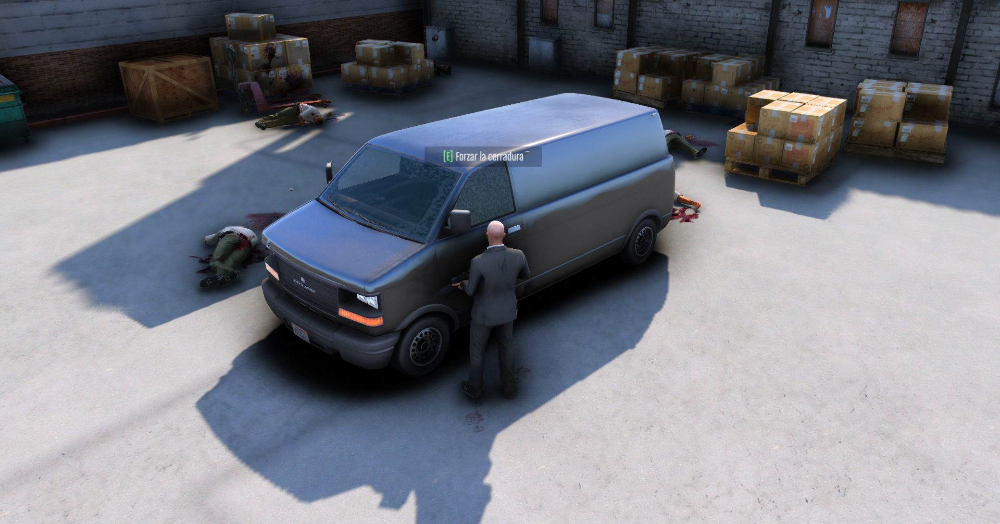
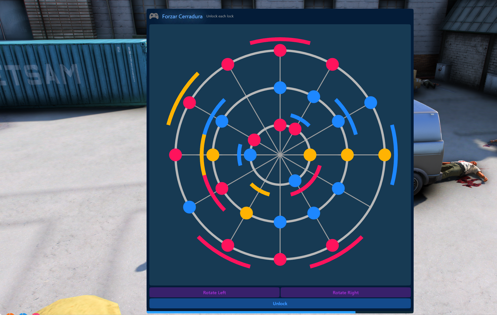
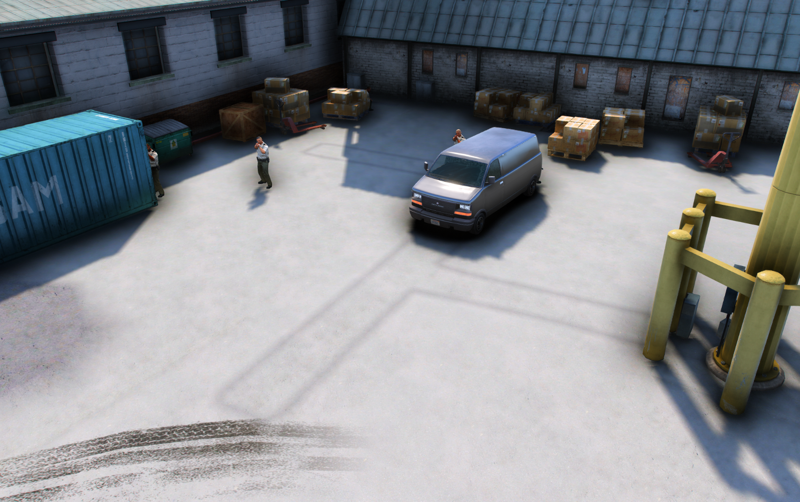
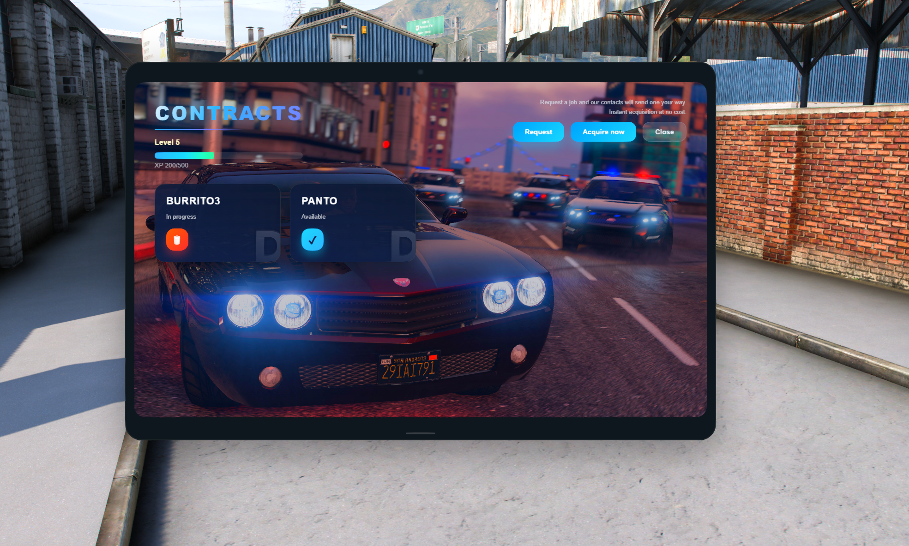

# 🚗 MK_boosting — Car Boosting Script for FiveM

> **Author:** MasterK &nbsp;|&nbsp; **Version:** 1.0.0 &nbsp;|&nbsp; **Framework:** ESX / QBox / QBCore  
> A professional, fully configurable vehicle-boosting system with tiers, minigames, police dispatch, admin tools, and a custom NUI tablet.

---

## 📋 Table of Contents

1. [Overview](#overview)
2. [Commands](#commands)
3. [Tier System](#tier-system)
4. [Minigames](#minigames)
5. [NPC Guards](#npc-guards)
6. [Police Dispatch](#police-dispatch)
7. [VIN Scratch System](#vin-scratch-system)
8. [Progression System (XP & Levels)](#progression-system-xp--levels)
9. [Tablet UI](#tablet-ui)
10. [Admin Panel — /assigncontract](#admin-panel--assigncontract)
11. [Technical Compatibility](#technical-compatibility)
12. [Possible Configurations](#possible-configurations)
13. [Optimizations & Architecture](#optimizations--architecture)
14. [Database](#database)
15. [Installation](#installation)

---

## Overview

**MK_boosting** is a feature-rich car theft / boosting script for FiveM roleplay servers. Players receive contracts through an in-game tablet, locate a target vehicle anywhere on the map, complete skill-based minigames to unlock it, evade or eliminate guards, and deliver the vehicle to a drop-off point to earn a cash reward. Difficulty scales with a 5-tier system (D → S), rewarding progression and skill.

---

## Commands

### `/boost`
Opens the **boosting tablet** — the main interface where players can:
- View their current level and XP bar
- Browse all active contracts assigned to them
- Request a new contract (with optional cooldown)
- Acquire a contract instantly (optional paid skip)
- Accept or cancel individual contracts

> Supports an optional **item requirement** (`Config.Tablet.RequireItem`) — players must hold a physical item (e.g. `boosting_tablet`) in their inventory to open it.

---

### `/assigncontract` *(Admin Only)*
Opens an **in-game admin panel** that allows administrators to:
- See a live list of all connected players
- Choose the target player to assign a contract to
- Select a **tier (D / C / B / A / S)**
- Pick a specific vehicle model or let the system choose randomly
- Set a **custom reward amount** (pre-filled with the tier default)
- Toggle the **VIN scratch option** for the assigned contract
- Confirm and instantly push the contract to the player's tablet

> Permission-checked server-side using the framework's admin/group system.  
> When no other players are online, the admin can assign a contract to themselves.

---

## Tier System

Contracts are divided into **5 tiers**, each defining difficulty, payout, required minigames, and the vehicle pool:

| Tier | Min. Level | Vehicles (example)                 | Minigames | Base Reward |
|------|-----------|-------------------------------------|-----------|-------------|
| D    | 1         | Panto, Issi2, Dilettante, Burrito3  | 1         | $2,500      |
| C    | 10        | Blista, Futo, Premier, Asea         | 1         | $7,000      |
| B    | 20        | Sultan, Kuruma, Buffalo, Jester     | 2         | $15,000     |
| A    | 35        | Adder, Vagner, Comet2, Pariah, Elegy| 2         | $30,000     |
| S    | 50        | T20, Zentorno, Italigtb, Osiris, Vagner | 3     | $50,000     |

> All tiers, vehicles, level requirements, and rewards are **fully configurable** in `config.lua`.

---

## Minigames

MK_boosting integrates **bd-minigames** for the lock-breaking phase. All 6 minigames are available and exposed as **exports** that any other script on your server can use:

| Minigame      | Description                                   |
|---------------|-----------------------------------------------|
| **Lockpick**  | Pin-tumbler lock interaction (levels + timer) |
| **Chopping**  | Fast-key sequence chopping mechanic           |
| **PinCracker**| Numeric PIN brute-force puzzle                |
| **RoofRunning**| Grid-based movement puzzle                   |
| **Thermite**  | Board-fill thermite blast puzzle              |
| **Terminal**  | Memory + typing laptop terminal challenge     |

The number of minigames a player must complete before stealing the vehicle is defined by the **tier** (`Config.Tiers[tier].minigames`). Higher tiers require completing more consecutive minigames.


*The `[E] Forzar la cerradura` interaction prompt appears on the target vehicle after guards have been handled, triggering the minigame sequence.*


*Active minigame screen during the lock-bypassing phase — players must complete this challenge before they can take control of the vehicle.*

### Public exports (usable by other scripts)
```lua
exports["MK_boosting"]:StartLockpickGame("Forzar Cerradura", 3, 30)
exports["MK_boosting"]:StartChoppingGame(12, 30)
exports["MK_boosting"]:StartPinCrackerGame(3, 20)
exports["MK_boosting"]:StartRoofRunningGame(5, 5, 30)
exports["MK_boosting"]:StartThermiteGame(20, 7, 7, 30)
exports["MK_boosting"]:StartTerminalGame(4, 2, 20, 10, 4)
```

---

## NPC Guards

Each tier spawns a configurable number of **armed NPC guards** around the target vehicle. Guards are hostile only to the player who accepted the contract, preventing griefing.

| Tier | Guards | Weapons                          | Accuracy | Health | Armour |
|------|--------|----------------------------------|----------|--------|--------|
| D    | 0      | Pistol                           | 25%      | 160    | 20     |
| C    | 2      | Pistol, Micro SMG                | 35%      | 180    | 40     |
| B    | 3      | SMG, Micro SMG                   | 45%      | 200    | 60     |
| A    | 4      | Carbine Rifle, Assault SMG       | 55%      | 220    | 80     |
| S    | 5      | Carbine Rifle, SMG               | 65%      | 260    | 100    |

- **Spawn radius**: configurable min/max distance from the vehicle (`Config.ContractEnemySpawnRadius`)
- **Aggro range**: guards enter combat within a configurable radius (`Config.ContractEnemyAggroRange = 20.0`)
- **Guard models**: randomized from a configurable list (`Config.ContractEnemyModels`)


*Aerial view of an industrial district: one guard neutralized, another still on patrol around the target vehicle.*

---

## Police Dispatch

Fully modular dispatch integration. When a player starts a minigame, a police alert may fire, with the **probability scaling by tier**:

| Tier | Alert Probability |
|------|------------------|
| S    | 100%             |
| A    | 90%              |
| B    | 70%              |
| C    | 50%              |
| D    | 30%              |

### Supported dispatch systems

| Config value        | Resource             |
|---------------------|----------------------|
| `NONE`              | No alert sent        |
| `PS_DISPATCH_ESX`   | ps-dispatch-esx      |
| `CD_DISPATCH`       | cd_dispatch          |
| `QB_DISPATCH`       | ps-dispatch (QB/QBX) |
| `ORIGEN_POLICE`     | origen_police        |

Switch with a single line: `Config.DispatchSystem = 'QB_DISPATCH'`

---

## VIN Scratch System

After successfully stealing a vehicle, players can run `/descifrarvin` to **scrub the VIN** and register the vehicle into their personal garage.

- Toggle globally with `Config.AllowVinScratch = true/false`
- **Probability per tier** — higher-end vehicles are harder to scrub:
  ```
  S = 40%  |  A = 0%  |  B = 0%  |  C = 95%  |  D = 0%
  ```
- **Probability per vehicle model** — overrides the tier value for specific models:
  ```lua
  ["zentorno"] = 25   -- nearly impossible
  ["osiris"]   = 0    -- military-grade security, always fails
  ["panto"]    = 99   -- nearly always succeeds
  ```
- Scraped vehicles are saved to the player's garage using either **QBox/QBCore** (`player_vehicles`) or a **legacy ESX** schema — configurable via `Config.OwnedVehicles.mode`.


*At the delivery zone the player sees two choices: `E` to deliver the vehicle for the full cash reward, or `X` to scrub the VIN and keep the vehicle in their personal garage.*

---

## Progression System (XP & Levels)

Players earn XP for every completed or failed contract attempt, and level up to unlock higher-tier contracts:

| Event              | XP Earned            |
|--------------------|----------------------|
| Contract completed | `Config.XP_PER_SUCCESS` (default: 50) |
| Contract failed    | `Config.XP_PER_FAIL` (default: 15)    |

XP required to reach the next level follows the formula:

$$\text{XP}_{\text{next}} = \text{LEVEL\_XP\_BASE} \times \text{current level}$$

Default base: **100 XP** per level multiplier. The level and XP bar are displayed live in the tablet UI.

---

## Tablet UI

The tablet is a custom **NUI (HTML/CSS/JS)** interface fully embedded in the game. It shows:

- Player name, level, and XP progress bar
- Active contracts list with tier badge, vehicle name, and reward
- Accept / Cancel buttons per contract
- Request new contract button (with live cooldown timer)
- Instant acquisition option (free or paid, configurable)
- Admin panel access (visible only to admin-level players)

> The tablet opens with `/boost` or via an inventory item, configurable in `Config.Tablet`.

### Screenshots


*The CONTRACTS tablet showing Level 5 · XP 150/500, an active Tier D BURRITO3 contract, and the Request / Acquire now / Close action buttons.*

---

## Admin Panel — `/assigncontract`

The admin panel (rendered inside the same NUI tablet) provides:

- **Player selector** — live list of all currently connected players
- **Tier selector** — D / C / B / A / S with reward preview
- **Vehicle selector** — scoped to the chosen tier's vehicle pool, or random
- **Custom reward field** — override the default tier payout
- **VIN scratch toggle** — grant or deny the ability to scrub VIN for this specific contract
- **Assign button** — inserts the contract directly to the player's active list and notifies them in-game

All actions are permission-validated on the server (no client-side trust).

---

## Technical Compatibility

| Feature             | Supported options                                          |
|---------------------|------------------------------------------------------------|
| **Framework**       | ESX, QBCore, QBox (auto-detected via bridge)               |
| **Database**        | oxmysql                                                    |
| **Notifications**   | AUTO, ESX, ADVANCED_ESX, OX_LIB, T_NOTIFY, MYTHIC, QBX    |
| **Dispatch**        | NONE, ps-dispatch-esx, cd_dispatch, QB_DISPATCH, origen_police |
| **Minigames**       | bd-minigames                                               |
| **Locales**         | `en` (English), `es` (Spanish)                             |
| **Garage mode**     | QBox/QBCore schema, Legacy ESX schema                      |

---

## Possible Configurations

Below are the main configuration levers available in `config.lua`:

| Option                          | Description                                                       |
|---------------------------------|-------------------------------------------------------------------|
| `Config.Debug`                  | Enable detailed server/client console logs                        |
| `Config.DebugMySQLParams`       | Log all MySQL query parameters for debugging                      |
| `Config.Locale`                 | Language (`'en'` / `'es'`)                                        |
| `Config.NotificationSystem`     | Notification framework (`AUTO` recommended)                       |
| `Config.NotificationDuration`   | How long notifications stay on screen (ms)                        |
| `Config.DispatchSystem`         | Which police dispatch resource to use                             |
| `Config.DispatchProbabilityByTier` | Per-tier chance (%) of alerting police                         |
| `Config.MaxContracts`           | Max simultaneous contracts per player (default: 6)                |
| `Config.Tiers`                  | Minigames count and base reward per tier                          |
| `Config.Vehicles`               | Vehicle pool per tier                                             |
| `Config.RequiredLevel`          | Minimum player level to appear a given tier                       |
| `Config.ContractEnemies`        | Guards count, weapons, accuracy, HP, armour per tier              |
| `Config.ContractEnemyModels`    | NPC ped models for guards                                         |
| `Config.ContractEnemySpawnRadius` | Min/max distance to spawn guards around the vehicle            |
| `Config.ContractEnemyAggroRange`  | Distance at which guards start attacking                        |
| `Config.SpawnLocations`         | Coordinates where target vehicles appear                          |
| `Config.DropOffs`               | Coordinates for vehicle delivery points                           |
| `Config.AllowVinScratch`        | Enable/disable the VIN scrubbing system                           |
| `Config.VinScratchProbabilityByTier` | Success chance per tier                                    |
| `Config.VinScratchProbabilityByVehicle` | Override success chance per specific vehicle model       |
| `Config.Tablet.UseCommand`      | Allow `/boost` command                                            |
| `Config.Tablet.RequireItem`     | Require item in inventory to open tablet                          |
| `Config.Tablet.ItemName`        | Name of the required item                                         |
| `Config.ContractRequestDelay`   | Min/max minutes between contract requests                         |
| `Config.InstantContractCost`    | Cost ($) to skip the cooldown (0 = free)                          |
| `Config.ContractSearchRadius`   | Radius (m) of the red search circle on the map                    |
| `Config.SearchAreaOffset`       | How off-center the circle can be from the actual vehicle          |
| `Config.TimeLimit`              | Minutes allowed to complete a contract                            |
| `Config.PlayDeliveryCinematic`  | Play a cinematic when delivering without scrubbing                |
| `Config.XP_PER_SUCCESS`         | XP awarded for completing a contract                              |
| `Config.XP_PER_FAIL`            | XP awarded for a failed attempt                                   |
| `Config.LEVEL_XP_BASE`          | XP multiplier for level-up threshold                              |
| `Config.OwnedVehicles`          | Garage save mode (`'qbox'` or `'legacy'`) and table config        |

---

## Optimizations & Architecture

- **Bridge pattern**: all framework calls (inventory, player data, admin check, notifications) are abstracted through a `BridgeClient` / `Bridge` layer. Swapping frameworks requires no changes to core logic.
- **Async database calls**: all MySQL operations use `oxmysql` async wrappers — no blocking the server thread.
- **Lazy guard initialization**: NPC guards only spawn when a contract is accepted, and are cleaned up on contract end or server event.
- **Model cache**: VIN probability lookups use a per-session Lua table (`vehicleModelVINCache`) to avoid recomputing the same model's security check.
- **Singleton notifications**: `NotificationQueue` prevents duplicate notifications from stacking during async flows.
- **Per-contract overrides**: admins can set VIN permissions at the individual contract level, stored in memory (`contractVinScratchOverrides`), so it doesn't bloat the database.
- **Cooldown management**: contract request cooldowns are tracked server-side per identifier, preventing client-side bypass.
- **Dispatch probability check**: rolled server-side, not client-side, preventing exploit manipulation.
- **No client-side permission trust**: admin actions (`/assigncontract`, panel submissions) are fully verified server-side before execution.
- **pcall wrappers**: all MySQL inserts, export calls, and framework interactions are wrapped in `pcall` to prevent a single error from crashing the resource.

---

## Database

Two tables, auto-created via `sql/boosting.sql`:

### `boosting_players`
| Column       | Type        | Description                       |
|-------------|-------------|-----------------------------------|
| `identifier` | VARCHAR(60) | Player unique ID (primary key)    |
| `xp`         | INT         | Current experience points         |
| `level`      | INT         | Current player level              |
| `last_accept`| TIMESTAMP   | Timestamp of last contract accept |

### `boosting_contracts`
| Column              | Type        | Description                              |
|--------------------|-------------|------------------------------------------|
| `id`                | INT (PK)    | Contract unique ID                       |
| `owner_identifier`  | VARCHAR(60) | Player who owns the contract             |
| `tier`              | VARCHAR(2)  | Contract tier (D/C/B/A/S)               |
| `vehicle_model`     | VARCHAR(64) | Vehicle model name                       |
| `reward`            | INT         | Cash payout on completion                |
| `spawn_x/y/z/h`     | DOUBLE      | Vehicle spawn coordinates & heading      |
| `drop_x/y/z`        | DOUBLE      | Delivery point coordinates               |
| `status`            | VARCHAR(20) | `pending` / `completed` / `failed`       |
| `accepted`          | TINYINT     | Whether the contract has been accepted   |
| `active`            | TINYINT     | Whether the contract is still active     |
| `assigned_by_admin` | TINYINT     | 1 if created via admin panel             |
| `created_at`        | TIMESTAMP   | Creation timestamp                       |

---

## Installation

1. Copy `MK_boosting` and `bd-minigames` into your resources folder.
2. Run `sql/boosting.sql` on your database.
3. Add to `server.cfg`:
   ```
   ensure bd-minigames
   ensure MK_boosting
   ```
4. Configure `config.lua` to match your framework, dispatch system, and notification preference.
5. (Optional) Add the tablet item to your items table:
   ```sql
   INSERT INTO `items` (`name`, `label`, `weight`, `rare`, `can_remove`)
   VALUES ('boosting_tablet', 'Boosting Tablet', 1, 0, 1);
   ```
6. Restart the server — the script initializes automatically.

---

> **Screenshots welcome!**  
> If you'd like to add in-game screenshots of the tablet UI, admin panel, or minigames in action, send them and they'll be embedded in this document.
